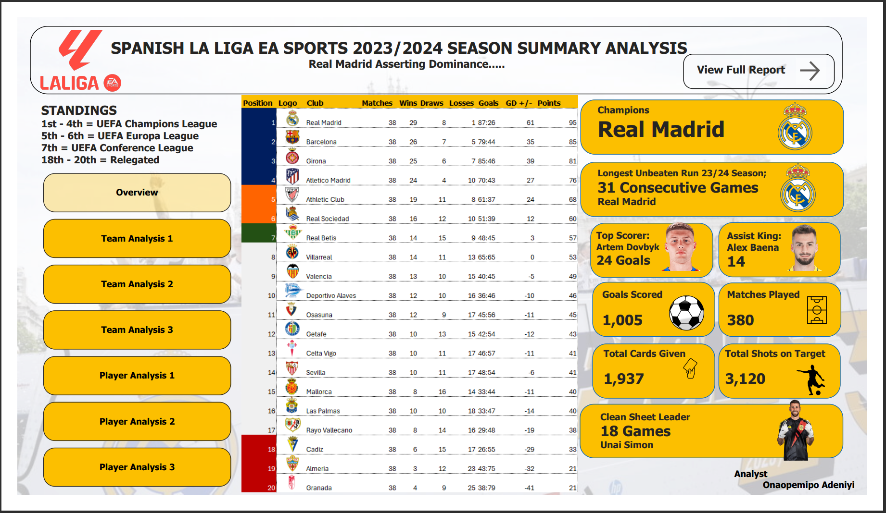

# PERSONAL-PROJECT-2-LA-LIGA-SEASON-23-24-ANALYSIS-
This contains an Analysis of the Statistics gotten from the Concluded SPANISH LA LIGA EA SPORT 2023/2024 SEASON. 

## Table of Content
1.0 - Introduction

2.0 - Data Source

3.0 - Tools Used

4.0 - Data Transformation

5.0 - Data Analysis and Visualizations

6.0 - Insights

## 1.0 - Introduction
The Aim of this analysis is to use the Statistics which were accumulated from the Concluded SPANISH LA LIGA EA SPORT 2023/2024 SEASON. 
This analysis will show some key metrics such as the Player with the Highest Number of goals, Player with the Highest Number of Assists, Club with the most goals, Club with the most crosses and much more. 

## 2.0 - Data Sources
The Data Source for this Analysis was gotten from the Official Website of the Spanish League Website, Sofascore, Footystats, Trasfermarkt and FBref.com.  

## 3.0 - Tools Used
3.1 -**Microsoft Excel** [Download Here](www.microsoft.com)

3.2 -**Microsoft PowerBi** [Download Here](www.microsoft.com)

## 4.0 - Data Transformation
Using Microsoft Excel, i was able to extract the data from the website and made sure that all of the data were correct. I examined it well to measure the accuracy across all the sources i used to ensure transparency. After the Necessary cleaning was done, i loaded the Dataset to PowerBi where the Visualization was done. 

## 5.0 - Data Analysis and Visualization 
With the Data loaded to PowerBi, i made some certain analysis to find some interesting metrics as to what were the key insights gotten from the just concluded season in the Spanish League. 
With the aid of the visuals i created, i was able to highlight some of the key statistics that occured during the season. I was able to use the criteria of the team and club. 

## 6.0 - Insights 
There are some major insights gotten from this analysis, they include

6.1 - *It showed that Artem Dovbyk was the highest goal scorer, followed by Alexander Solorth.*

6.2 - *It showed that Real Madrid scored the highest number of goals this season with 87 goals.*

6.3 - *It showed that Barcelona had the Highest Number of Touches.*

6.4 - *It showed that Sevilla had the Highest Number of Tackles Won.*

6.5 - *It showed that Almeria made the most clearances in the season.*

6.6 - *It showed that Real Madrid were dangerous moving forward in the Attacking Penalty Area on numerous times with the Attacking due of Vinicius and Rodrygo.*
